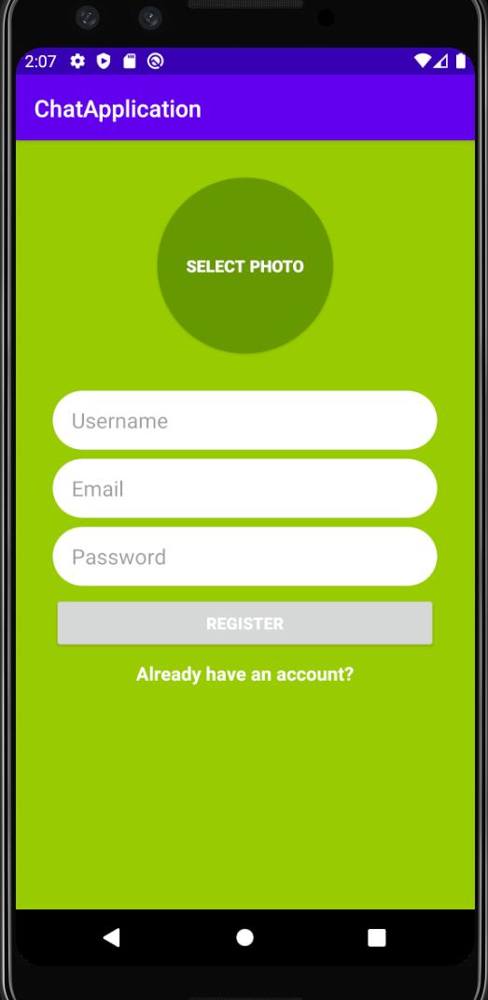
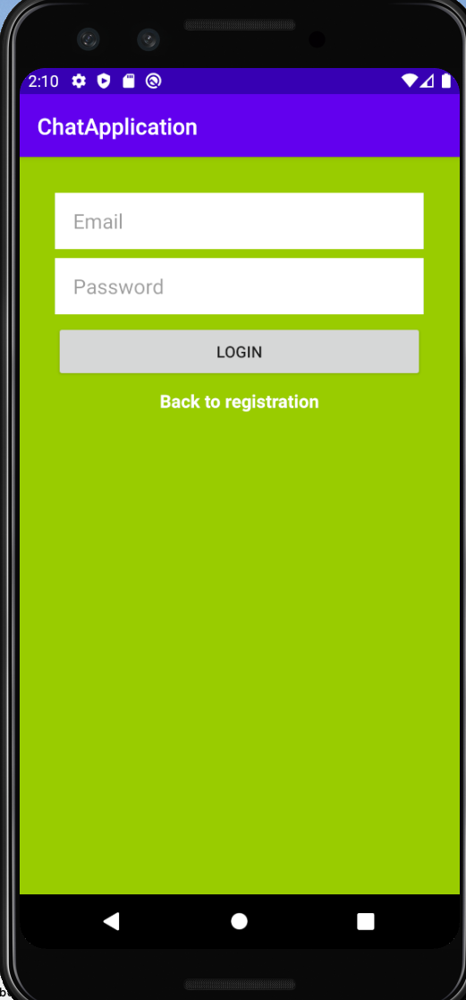
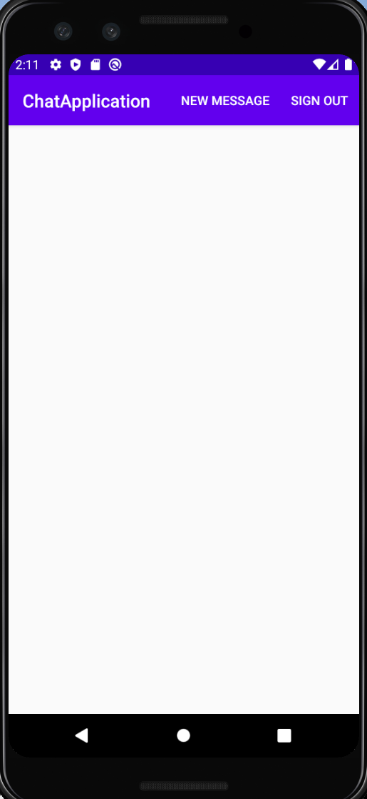
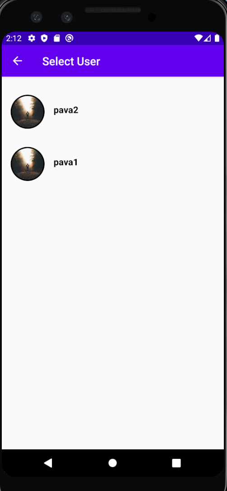
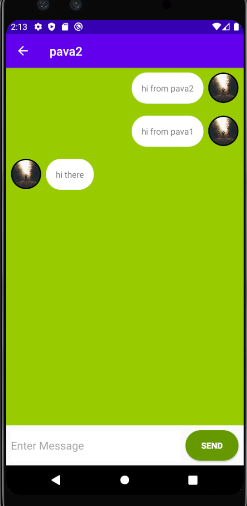
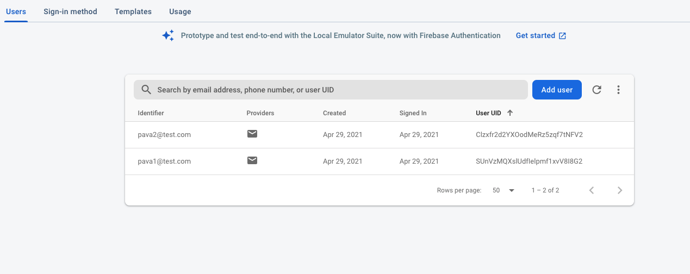
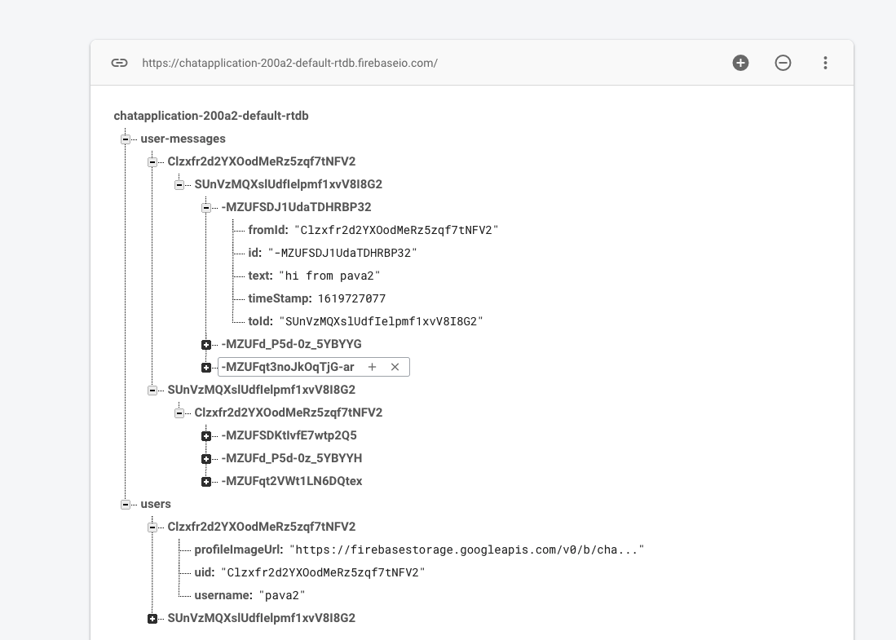
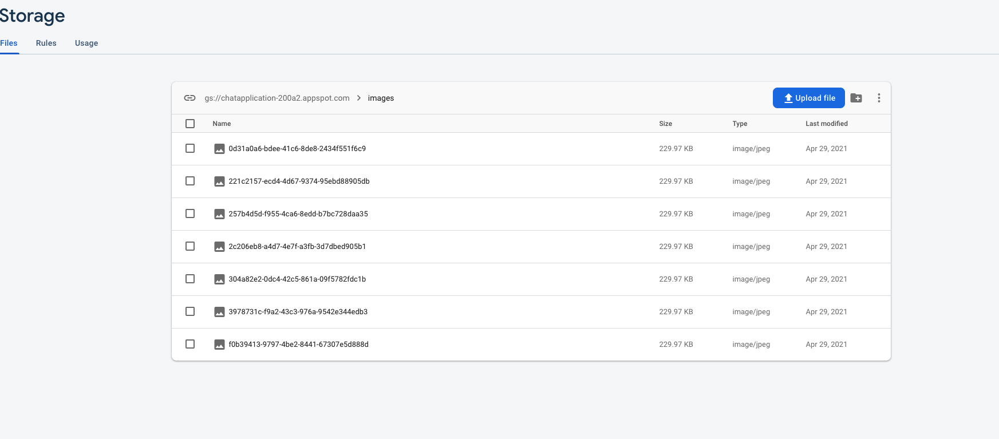

## Chat Application

one drive link for demo - https://1drv.ms/u/s!Atlj3hm1Xtus6Vl-2OPRJSa0Ywnv?e=ODukIm
This project makes use of the following:
* Firebase Authentication
* Firebase realtime database
* Storage

This project has the following intents:

1. User registration
   
   

2. User Login
   
    

3. Landing page
   
    

4. User List
   
    

5. Select particular user and read messages
   
     

Backend infrastructure:

1. Authentication
   
    

2. Realtime database
   
   

3. Storage for images for polyglot persistance
   
    